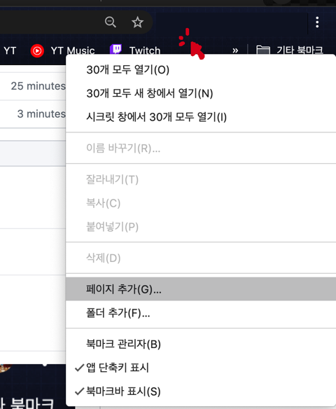
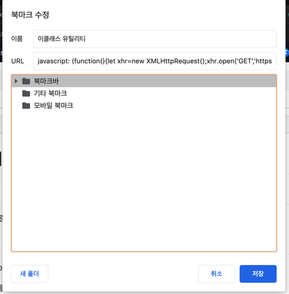

# 브라우저 스크립트 설치방법

## 1. 올바른 소스파일 링크 준비

*설치하고자 하는 소스코드*가 업로드 되어있는 주소를 준비한다.

```javascript
javascript: (src=>{'use-strict';let xhr=new XMLHttpRequest();xhr.open('GET',src);xhr.onreadystatechange=()=>{if(xhr.readyState==4)eval(xhr.responseText);};xhr.send();})('SOURCE');
```

위 **소스코드**에서 가장 마지막 부분에 있는 `SOURCE`를 필요에 맞게 _준비한 소스코드_ 주소로 변경하면 된다.

## 2. 브라우저에 북마크 추가

| 페이지 추가하기                      | 북마크 수정                                  |
| ------------------------------------ | -------------------------------------------- |
|  |  |

1. 구글 크롬에서 북마크바에 페이지를 추가한다.
1. 새로 추가할 북마크의 이름은 편의상 아무렇게나 지으면 된다.
1. URL칸에 있던 본래의 내용을 지우고 빈 칸에다 위에서 **준비한 소스코드**를 붙여넣는다.

## 3. 설치한 소스코드의 실행

위에서 생성한 북마크를 원하는 페이지에서 눌러보면 스크립트가 동작한다.
