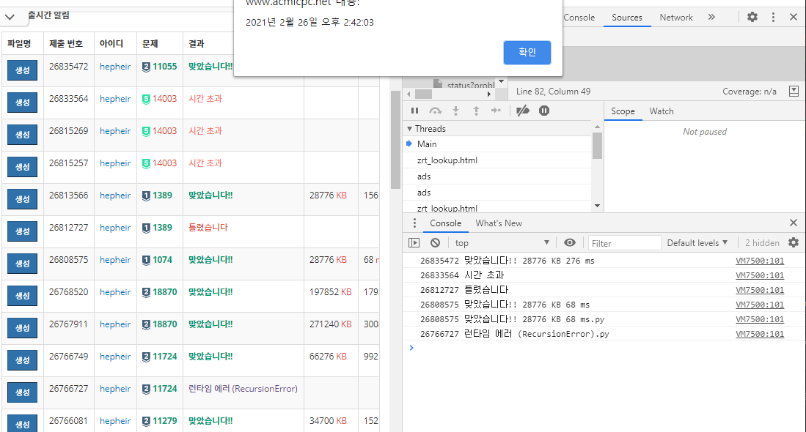

# 소스코드 파일명 생성기

[BOJ-Solutions](https://github.com/Hepheir/BOJ-Solutions) 레포지토리에 저장할 소스코드의 파일명을 보다 쉽게 생성하기 위해 만든 스크립트.

백준 홈페이지의 [채점현황](https://www.acmicpc.net/status) 페이지에서 사용이 가능하다.

| 적용 모습 (세부 옵션 설정)                         |
| -------------------------------------------------- |
|  |

| 적용 모습 (출력 시)                                |
| -------------------------------------------------- |
|  |

## 소스 코드

- [index.js](./script/index.js)

## 참고

- [브라우저 스크립트 설치방법](../브라우저%20스크립트%20설치방법.md)
